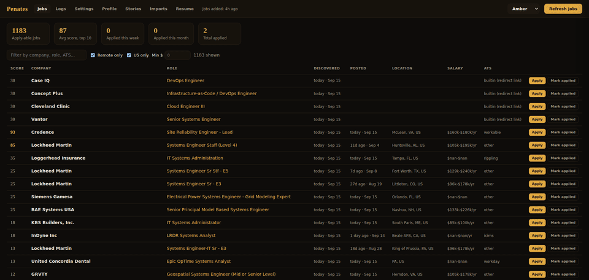
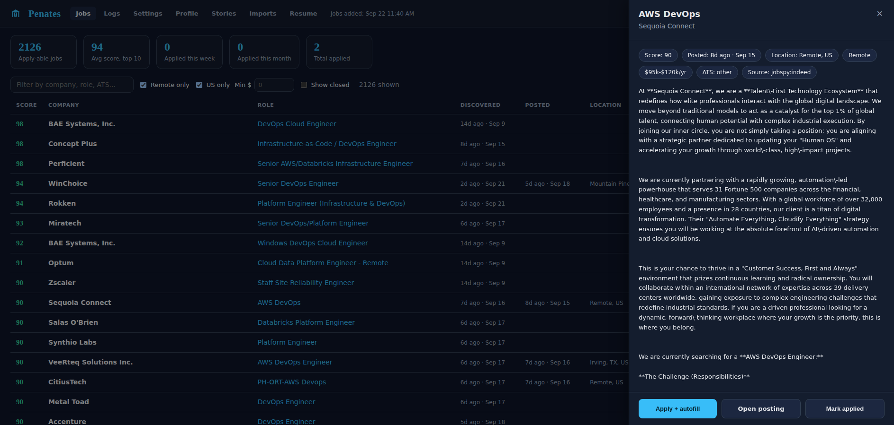

# Project Penates

**Local answers. Locked facts. You submit.**

A local helper for job applications. It fills what it can from a profile you own, and it
drafts the written questions the paid extensions meter (why this company, tell us about a
time, screening essays) with a model running on your own machine. It never submits the
form.

No account. No cloud LLM required. Nothing leaves the machine by default.

> Two ways to fill, both in a normal browser through one extension: a whole-page **Fill
> application** that handles identity, EEO, yes/no and dropdowns and drafts the essays, and
> a per-field answer helper for one written question at a time. Both stop before Submit. A
> separate Playwright/debug-Chrome runner predates the extension and is now legacy.

## Why it exists

Applying today means filling the same form far more times than it used to, just to reach
a human. Browser autofill already handles name, email, and phone. The unique written
questions are the part the paid tools either skip or answer by shipping your history to a
cloud API and charging you for it.

Project Penates is the other half: your facts live in YAML on disk, the model runs
locally through Ollama, and it is not allowed to claim a credential you didn't put in the
profile. A fluent lie on your application is worse than a blank box.

## Why "Penates"

The Penates were Rome's household gods: guardians of the inner home, kept at your own
hearth and carried with the family when it moved, not a temple you rent. Fitting for a
tool whose whole point is that your data stays home and belongs to you.

## What works today

- **Whole-page fill in normal Chrome:** one "Fill application" button scans the form
  (light DOM, open shadow roots, same-origin iframes), fills identity, EEO, yes/no and
  radio groups, picks the right option in `react-select`-style dropdowns, drafts the
  essays, and shows a review panel of what it filled, flagged, or left for you.
- **Per-field helper:** right-click or a shortcut on any written-answer field for a single
  grounded draft you can edit, regenerate, and insert.
- **Genre-aware answers:** each written question is classified (owned-project story,
  hypothetical, why-company, gap) and answered from a **story bank** you control - real
  experiences you would tell in an interview but never put on the résumé. The model dresses
  ONE story or states a gap; it never invents a project. A code validator rejects skills-dump
  openings, off-target word counts, and definitions where a proposal was asked for, and
  regenerates once before flagging for review.
- **Shows only on application forms:** the fill bubble and per-field helper stay hidden on
  Gmail, GitHub, search results, and job descriptions; a Settings page (mode plus per-site
  allow/deny lists) overrides the detection when it guesses wrong.
- Deterministic identity fields (name, email, phone, city, yes/no) from a locked profile.
- Answers grounded on your real work history: employer, dates, stack.
- **Gap guard:** a tool or cert you didn't list stays unclaimed; the field is answered honestly and flagged for review.
- Optional fields you marked "leave blank" stay blank instead of getting a generated essay.
- It stops before Submit, always.

The whole-page fill is early: it is solid on Greenhouse and `react-select` forms and widens
from there. Salesforce Lightning and Workday shadow forms are still hardening.

## Find jobs faster: discovery + dashboard

Applying is only half the grind. The other half is finding the postings worth applying to.
Penates now pulls openings from several sources into one local queue, ranks them against
your lane, and shows them in a dashboard so you stop checking five sites by hand every day.



*The dashboard, with selectable color themes (Slate, Nord, Light, and more).*

Click any row for a preview pane with the posting's details and a one-click path to the
real apply page:



### Sources

| Source | How | Notes |
|---|---|---|
| **Company ATS boards** | **direct public APIs (Greenhouse, Lever, Ashby)** | **the reliable spine: clean titles, locations, posted dates, real apply URLs; from `config/companies.yml`** |
| LinkedIn / Indeed / Google | JobSpy (MIT) | Easy Apply on LinkedIn is skipped (no employer link to fill) |
| hiring.cafe | public `_next/data` JSON | direct employer apply URLs, salary, posted date |
| Built In | server-rendered HTML | Easy Apply cards skipped; resolves to the employer ATS |
| RemoteOK | public JSON API | remote-only, no key |
| Remotive | public JSON API | remote-only, no key (thin catalog) |
| ZipRecruiter | JobSpy, opt-in | off by default (Cloudflare-gated) |

Everything runs locally and writes to `data/jobs.json`. Nothing needs a key or an account.

### Pipeline

Each source is a small script that filters to your titles and appends new postings to the
store, deduped by URL. Then `resolve.py` turns listing links into real apply URLs where it
can, and `rank.py` scores each row against your lane.

```
python scan_ats.py       # company ATS boards (Greenhouse/Lever/Ashby) - the spine
python discover.py       # LinkedIn / Indeed / Google via JobSpy
python hiringcafe.py     # hiring.cafe
python builtin.py        # Built In (employer-direct only)
python remoteok.py       # RemoteOK
python remotive.py       # Remotive
python resolve.py        # listing URL -> employer apply URL
python rank.py           # score against your lane
```

Or skip the CLI: open the dashboard and hit **Refresh jobs**, which runs the whole pipeline
in the background and respects the source toggles in **Settings**.

### Dashboard

```
python serve.py                       # http://127.0.0.1:8765/dashboard
```

- **Jobs** - ranked, filterable, sortable list; each row opens a preview pane with an
  Apply + autofill button that hands off to the extension.
- **Settings** - edit your search terms and turn sources on or off (saved to `config.json`).
- **Logs** - discovery runs, fills, and answer generations.
- **Profile** - a read-only view of the facts the answer helper draws on.
- **Stories** - add and edit the story bank the answer engine draws on (the interview-grade
  experiences that never make the résumé), no YAML editing.
- **Themes** - a color picker in the header (default Slate); pick what is easy on your eyes.

Discovery finds and ranks; the extension fills; you review and submit. Same contract as the
rest of the tool: nothing leaves the machine, nothing auto-submits.

## What it is not

- Not an auto-apply bot.
- Not a résumé that grows extra degrees.
- Not a substitute for reading the posting.

## How it's split

| Layer | Job |
|---|---|
| `profile.yaml` + `data/work_history.yaml` | Source of truth. Not the model. |
| `fields.yaml` | Deterministic rules: yes/no, work authorization, city, salary, EEO you chose. |
| `answers.yaml` + `apply.py` | Deterministic identity + short intent-template answers (why-company, ratings). |
| `stories.yaml` + `essay.py` | The story bank and the genre engine: classify the question, retrieve ONE real story (or a gap), validate the draft in code. |
| Browser | One MV3 extension in normal Chrome (whole-page Fill + per-field helper) talking to a local server; a legacy CDP runner remains for reference. |
| Discovery (`scan_ats.py` + `sources/`, `discover.py`, `hiringcafe.py`, `builtin.py`, `remoteok.py`, `remotive.py`) | ATS-API boards first, then aggregators; pull postings into `data/jobs.json`, dedupe, `rank.py` scores, `serve.py` dashboard shows them. |
| You | Captchas, MFA, account creation, the final read, and Submit. |

Every answer resolves to one of three states: **AUTO** (deterministic, filled),
**REVIEW** (generated but touches a limited-experience area; filled and flagged), or
**PAUSE** (not enough grounded evidence; left for you). Two guards run first: the **gap
guard** (never claim a listed gap) and a **cross-contamination guard** (a "why this
company" answer must name the company on *this* page, never one pulled from another posting).

## Honesty

The model may rephrase work you actually did and use a company blurb you supplied. It may
not add degrees, years, clearances, or tools that aren't in your profile. If you don't
list Security+, it won't claim Security+. A missing fact becomes a review flag, never a
confident lie. You review every answer, and the tool never submits unless you explicitly
turn it on.

## Requirements

- Windows 10/11 (primary); macOS and Linux work for the answer path.
- Python 3.11 or 3.12, Google Chrome, [Ollama](https://ollama.com), Git.

```bash
ollama pull llama3.2:3b          # classify + short answers
ollama pull qwen2.5:7b-instruct  # grounded essays
```

Everything stays on localhost: Ollama `11434`, the tool's server `8765`, and (only for
the WIP runner) Chrome's debug port `9222`. No paid API, Docker, or database.

## Quickstart: the answer helper (supported)

1. Start Ollama and pull the two models above.
2. `pip install -r requirements.txt`
3. Copy the example configs and fill in your own facts (the real ones are git-ignored):
   ```
   cp profile.example.yaml profile.yaml
   cp data/work_history.example.yaml data/work_history.yaml
   cp application.example.yaml application.yaml
   cp stories.example.yaml stories.yaml            # your story bank (or add stories in the dashboard)
   cp config/companies.example.yml config/companies.yml
   ```
4. Start the local server: **Start Autofill Server.bat**, or `python serve.py`
   (serves `/answer` on `127.0.0.1:8765`).
5. In `chrome://extensions` (Developer mode, then Load unpacked), load the `essay-local/`
   folder. It works in your normal Chrome.
6. Focus a written-answer box, then right-click **Answer with local AI**, or press
   **Alt+A**. The draft is inserted; a toast shows the method and any review flag.

You can run this next to a commercial autofiller: let it do the structured fields, turn
off its AI on the unique questions, and let Penates handle those.

## Quickstart: WIP full-page autofill (lab)

The Playwright runner drives a Chrome started with `--remote-debugging-port=9222`
(**Launch Apply Chrome.bat**), attaches over CDP, fills a whole application, and stops
before Submit. Per-ATS handling for the sites listed above. Experimental.

```
python run_url.py --attach "<application URL>"
```

Submit stays blocked unless you set `APPLY_ALLOW_SUBMIT=1`. `APPLY_ICIMS_ADVANCE=1` lets
the iCIMS runner page through, still stopping before the last step.

## Configuration

| File | What it is | In repo |
|---|---|---|
| `profile.yaml` | Your locked facts (source of truth) | `.example` only; real is git-ignored |
| `data/work_history.yaml` | Dated employment history | `.example` only; real is git-ignored |
| `data/jobs.json` | Your application queue | `.example` only; real is git-ignored |
| `application.yaml` | The current job's company blurb | `.example` only; real is git-ignored |
| `stories.yaml` | Your story bank (interview-grade experiences the answer engine uses) | `.example` only; real is git-ignored |
| `config/companies.yml` | ATS boards to scan (Greenhouse/Lever/Ashby slugs) | `.example` only; real is git-ignored |
| `fields.yaml` | Field-label to profile mapping rules | shipped |
| `config.json` | Dashboard search terms + source toggles | `.example` only; runtime is git-ignored |
| `answers.yaml` | Intent templates for essays | shipped |
| `secrets.yaml` | Workday login (WIP runner only) | `.example` only; real is git-ignored |

## Related projects

| Project | Local LLM | Autofill | Essays | You submit | Note |
|---|---|---|---|---|---|
| Offlyn Apply | Ollama | wide ATS | rewrite menus | yes | Closest UX; strong context-menu verbs |
| AgentMan | Ollama | page agent | via agent | yes | Multi-step page walking |
| ApplyEase | Ollama / LM Studio | common fields | custom answers | yes | React + FastAPI + Postgres/pgvector |
| AI-Job-Applier | Ollama | one-click | context files | yes | Learn-as-you-go into cache |
| Persona | Ollama | none | resume builder | n/a | Same manifesto, different artifact |
| Simplify Copilot | cloud | strong | paid/cloud | yes | Great for structure; not local |

Penates' distinct position: local, plus a hard anti-fabrication contract, plus a
right-click control that works in a normal browser.

### Prior art: job discovery

The discovery side (`sources/`, `scan_ats.py`) follows patterns from these projects.
Penates borrows ideas, not code:

- [career-ops](https://github.com/career-ops-hq/career-ops) - the template: one provider
  adapter per ATS behind a common interface, a companies/portals config, and a fast public-API
  scan. MIT.
- [JobSpy](https://github.com/Bunsly/JobSpy) - the consumer-board scrapers (LinkedIn / Indeed /
  Google); Penates calls the `python-jobspy` package rather than vendoring it.
- [freehire](https://github.com/strelov1/freehire) - a large ATS-adapter architecture worth
  studying for the source interface and stable-fingerprint dedupe.

Penates keeps its own line: direct ATS APIs first with a small, auditable adapter per
provider (Greenhouse / Lever / Ashby), deduped into the same local store the apply side
already uses, and no code copied from AGPL-licensed tools.

## Roadmap

- **Done:** genre-aware answer engine with a user-owned story bank and a code validator
  (no skills dumps, honest gaps, enforced word/sentence counts); ATS-API job discovery
  (Greenhouse/Lever/Ashby) with dedupe; application-form-only overlay gating with a Settings
  page; a Stories tab to grow the bank without editing YAML.
- **Now (answer path):** better question-label detection (aria, headings, selected text),
  native value setter with `InputEvent` for React/LWC fields, per-intent length caps.
- **Next (structured fill without lying):** identity fields for Greenhouse/Rippling/Ashby directly in the extension (no CDP), strict Yes/No polarity, never pick "Decline to self-identify" when a real answer exists, Workday account and experience from `work_history.yaml`, Salesforce Flow shadow-DOM handling.
- **Later:** interview prep built on the same story bank (rehearse behavioral answers from your own STARs), a tailored résumé/cover-letter path from the same locked facts, an optional cloud OpenAI-compatible endpoint behind the same compose contract, a PII-free application log.
- **Not planned:** auto-submit as default, mass-apply, hosted SaaS, or inventing skills to raise a match score.

## Privacy

No telemetry; nothing leaves your machine by default. Never commit `profile.yaml`,
`secrets.yaml`, résumés, or the contents of `data/`; they're git-ignored. The public tree
ships only fake example configs.

## License

[PolyForm Noncommercial License 1.0.0](LICENSE): free to use, study, and modify for
noncommercial purposes; selling a hosted clone is not permitted.

## Disclaimer

This tool drafts and fills; **you** review and submit. You are responsible for the
accuracy of everything you send. It is built to keep your answers truthful, so keep them
that way.
